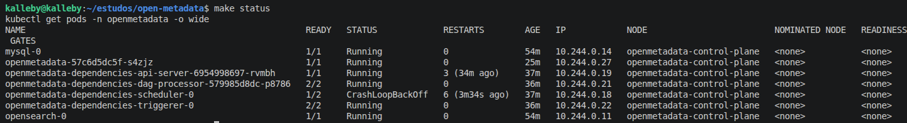
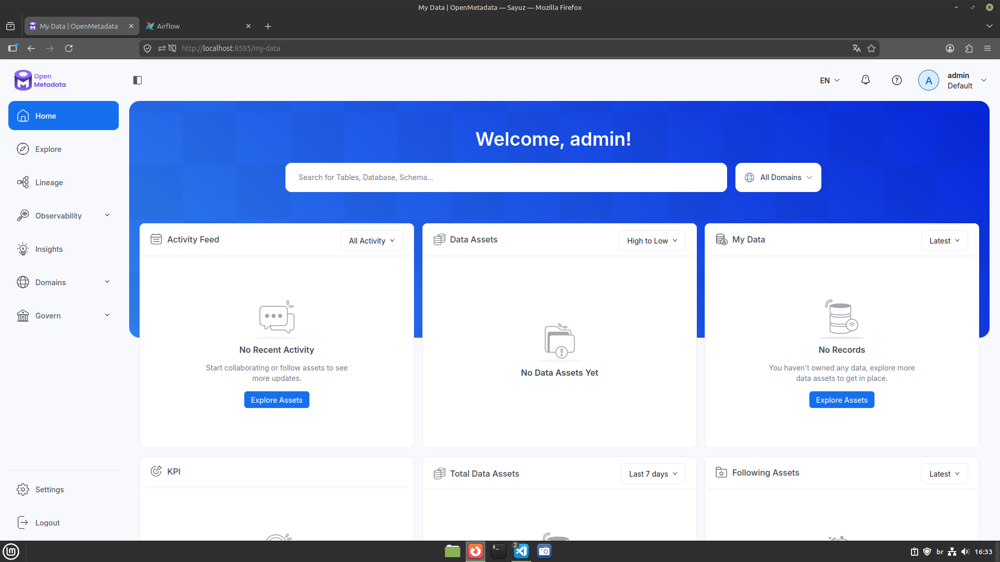
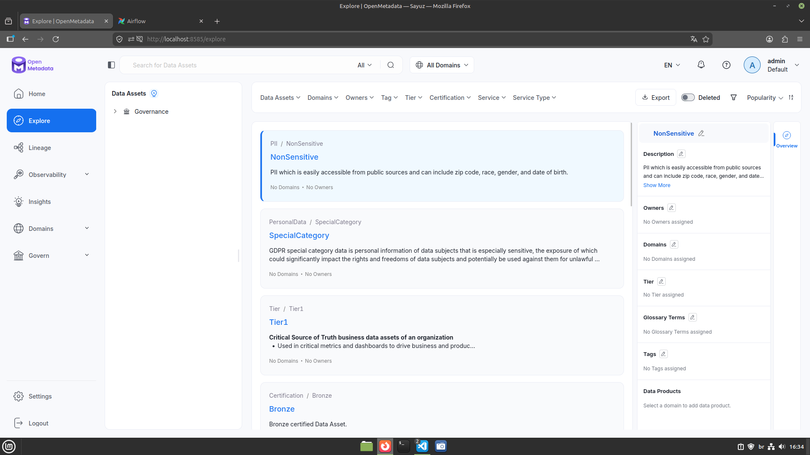
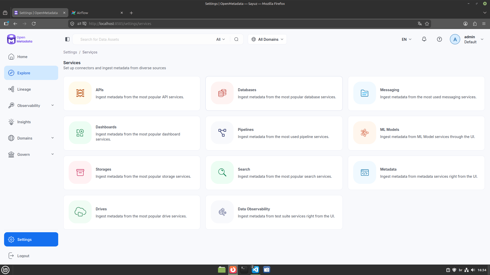
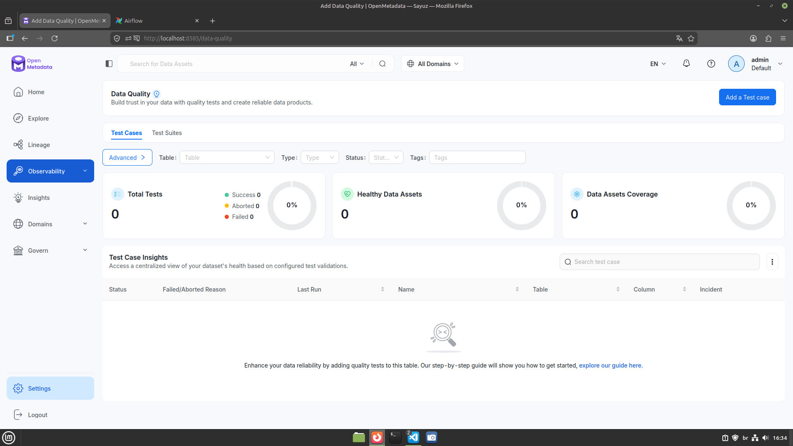
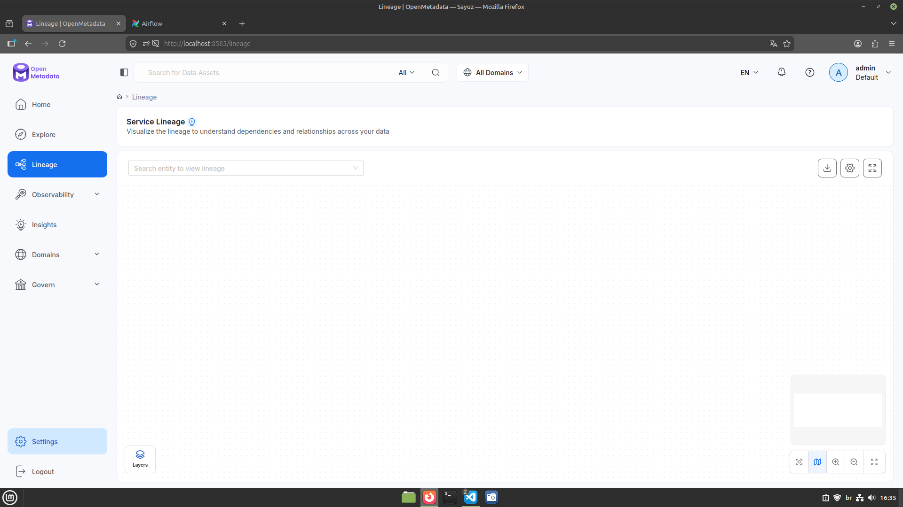

# OpenMetadata + Airflow on Kubernetes — Portfolio

A fully local Kubernetes environment running **OpenMetadata 1.12.5** integrated with
**Apache Airflow 3.1.7**, deployed via Helm on a kind cluster. Built for practicing
data quality, lineage, and governance workflows.

---

## Table of Contents

1. [Architecture](#1-architecture)
2. [Setup & Deployment](#2-setup--deployment)
3. [OpenMetadata UI](#3-openmetadata-ui)
4. [Airflow Integration](#4-airflow-integration)
5. [Challenges Solved](#5-challenges-solved)

---

## 1. Architecture

```
┌─────────────────────────────────────────────────────────┐
│  Namespace: openmetadata                                  │
│                                                           │
│  ┌─────────────────┐   REST API   ┌───────────────────┐  │
│  │  OpenMetadata   │◄────────────►│  Apache Airflow   │  │
│  │  Server 1.12.5  │              │  3.1.7            │  │
│  │  :8585          │              │  (LocalExecutor)  │  │
│  └────────┬────────┘              └────────┬──────────┘  │
│           │                                │             │
│           ▼                                ▼             │
│  ┌────────────────┐              ┌─────────────────────┐ │
│  │  MySQL 8       │              │  MySQL 8            │ │
│  │  (OM metadata) │              │  (Airflow metadata) │ │
│  └────────────────┘              └─────────────────────┘ │
│                                                           │
│  ┌─────────────────────────────────────────────────────┐ │
│  │  OpenSearch 2  (search & lineage index)             │ │
│  └─────────────────────────────────────────────────────┘ │
└─────────────────────────────────────────────────────────┘
```

### Components

| Component | Image | Role |
|-----------|-------|------|
| **OpenMetadata server** | `openmetadata/server:1.12.5` | REST API + React UI, stores metadata in MySQL, indexes into OpenSearch |
| **MySQL 8** | `bitnami/mysql:8` | Relational store for both OM entities and Airflow task metadata |
| **OpenSearch 2** | `opensearchproject/opensearch:2` | Full-text search index and lineage graph storage |
| **Airflow api-server** | `openmetadata/ingestion:1.12.5` | REST API + UI (Airflow 3 replacement for the old webserver) |
| **Airflow scheduler** | `openmetadata/ingestion:1.12.5` | Dispatches tasks to LocalExecutor |
| **Airflow dag-processor** | `openmetadata/ingestion:1.12.5` | Parses DAG files from the shared PVC |
| **Airflow triggerer** | `openmetadata/ingestion:1.12.5` | Handles deferrable operators |

### Key design decisions

- **Single MySQL instance** shared between OM and Airflow (two separate databases: `openmetadata_db` and `airflow_db`)
- **LocalExecutor** — no Redis or Celery workers needed; tasks run as subprocesses of the scheduler
- **DAG PVC** (`ReadWriteOnce`, 2Gi) — OM writes DAG files here; Airflow scheduler and dag-processor both mount it
- **Logs persistence disabled** — kind's local-path provisioner only supports `ReadWriteOnce`, incompatible with Airflow's default `ReadWriteMany` logs PVC
- **Security plugin disabled** on OpenSearch — simplifies local development (no TLS/auth)

---

## 2. Setup & Deployment

All operations are driven by a single `Makefile`. The full install goes from zero to a
running cluster in four commands.

### Repository layout

```
.
├── helm/
│   ├── deps-values.yaml    # MySQL + OpenSearch + Airflow overrides
│   └── om-values.yaml      # OpenMetadata server overrides
├── k8s/
│   ├── kind-cluster.yaml   # kind single-node cluster config
│   ├── namespace.yaml      # openmetadata namespace
│   └── secrets.yaml        # DB passwords + Airflow credentials
├── docs/
│   ├── openmetadata.md     # Kubernetes & OM study guide
│   └── portfolio.md        # This file
└── Makefile                # All automation targets
```

### Install sequence

```bash
# 1. Create the kind cluster
make cluster

# 2. Edit k8s/secrets.yaml with your passwords, then:
make setup           # repo + namespace + secrets + helm install deps

# 3. Wait for all dependency pods to reach Running
make status

# 4. Run Airflow DB migrations (pods are blocked on init containers until this)
make migrate-airflow

# 5. Deploy the OpenMetadata server
make om

# 6. Access the UIs (each in a separate terminal)
make port-forward-om       # → http://localhost:8585  (admin / admin)
make port-forward-airflow  # → http://localhost:8080  (admin / admin)
```

### Pod status after full deployment

> _Screenshot: `kubectl get pods -n openmetadata -o wide` showing all pods Running_

```
NAME                                                       READY   STATUS    RESTARTS
mysql-0                                                    1/1     Running   0
opensearch-0                                               1/1     Running   0
openmetadata-<hash>                                        1/1     Running   0
openmetadata-dependencies-api-server-<hash>                1/1     Running   0
openmetadata-dependencies-dag-processor-<hash>             2/2     Running   0
openmetadata-dependencies-scheduler-0                      2/2     Running   0
openmetadata-dependencies-triggerer-0                      2/2     Running   0
```

**Screenshot — all pods Running:**



---

## 3. OpenMetadata UI

Access at **http://localhost:8585** — login with `admin / admin`.

### Landing page



### Explore — data assets

The Explore view lists all ingested assets (tables, dashboards, pipelines, ML models)
with full-text search backed by OpenSearch.



### Services

Services are connections to data sources. OM ships with connectors for MySQL,
PostgreSQL, Snowflake, dbt, Kafka, and many more.



### Data Quality

After connecting a service and running metadata ingestion, you can attach data quality
tests to any table or column.



### Lineage

OpenMetadata builds a lineage graph showing how data flows between assets.



---

## 4. Airflow Integration

Access at **http://localhost:8080** — login with `admin / admin`.

When you create an ingestion pipeline in the OM UI:

1. OM generates a Python DAG file and writes it to the shared DAGs PVC
2. OM calls `POST /api/v2/dags/{dag_id}/dagRuns` on the Airflow REST API
3. Airflow executes the DAG using the `openmetadata-managed-apis` plugin (pre-installed in `openmetadata/ingestion`)
4. The plugin calls back to OM's REST API with metadata, lineage, and quality results

### Airflow DAG list


### Pipeline run triggered by OM


### Key configuration

```yaml
# helm/om-values.yaml
pipelineServiceClientConfig:
  apiEndpoint: "http://openmetadata-dependencies-api-server:8080"  # Airflow REST API
  metadataApiEndpoint: "http://openmetadata:8585/api"              # OM API (Airflow calls back here)
```

Both endpoints use Kubernetes service DNS — they resolve within the cluster without any
external exposure.

---

## 5. Challenges Solved

This environment was built from scratch, debugging each issue as it appeared. Below are
the most significant problems encountered and how they were resolved.

---

### Challenge 1 — PVC stuck in Pending (ReadWriteMany not supported)

**Symptom:** Airflow logs PVC remained in `Pending` state indefinitely.

**Root cause:** kind's built-in `local-path` provisioner only supports `ReadWriteOnce`.
The Airflow Helm chart defaults to `ReadWriteMany` for the logs PVC (designed for
multi-node clusters where multiple workers need simultaneous write access).

**Fix:** Disabled logs persistence entirely in `deps-values.yaml`:
```yaml
logs:
  persistence:
    enabled: false
```

The DAGs PVC uses `ReadWriteOnce` because with `LocalExecutor` only the scheduler and
dag-processor need it, and they run on the same node.

---

### Challenge 2 — Image pull failure (unreachable registry)

**Symptom:** All Airflow pods stuck in `Init:ErrImagePull`.

**Root cause:** The chart was pulling from `docker.open-metadata.org/openmetadata/ingestion:1.12.5`,
a custom registry that was unreachable from the local network (DNS: no such host).

**Fix:** Overrode the image repository to Docker Hub in `deps-values.yaml`:
```yaml
images:
  airflow:
    repository: openmetadata/ingestion
    tag: 1.12.5
```

---

### Challenge 3 — All Airflow pods stuck in Init:0/1 forever

**Symptom:** Every Airflow pod (scheduler, triggerer, dag-processor) stayed in `Init:0/1`
indefinitely. No migration Job was created despite `migrateDatabaseJob.enabled: true`.

**Root cause:** The `wait-for-airflow-migrations` init container polls:
```bash
airflow db check-migrations --migration-wait-timeout=60
```
It only *checks* for completed migrations — it never *runs* them. The chart's
`migrateDatabaseJob` did not create a Kubernetes Job in this chart version, so the
migrations were never applied.

**Fix:** Added a `make migrate-airflow` target that execs directly into the init container:
```bash
kubectl exec -n openmetadata openmetadata-dependencies-scheduler-0 \
  -c wait-for-airflow-migrations -- airflow db migrate
```
Once migrations complete, all init containers exit and the main containers start.

---

### Challenge 4 — Wrong service hostnames

**Symptom:** OM server failed to connect to MySQL and OpenSearch; Airflow DAGs failed to
call back to OM.

**Root cause:** Helm chart service names differ from what the official docs suggest.
Actual service names discovered via `kubectl get svc`:

| Expected | Actual |
|----------|--------|
| `openmetadata-dependencies-mysql` | `mysql` |
| `openmetadata-dependencies-opensearch` | `opensearch` |
| `openmetadata-dependencies-web` | `openmetadata-dependencies-api-server` |

The last one also reflects the Airflow 3 architecture change: the old `webserver` was
split into `api-server` + `dag-processor`.

**Fix:** Updated all hostnames in `helm/om-values.yaml` and `helm/deps-values.yaml`.

---

### Challenge 5 — OpenMetadata server crash (JWT NullPointerException)

**Symptom:** OM server pod crashed immediately with:
```
Caused by: java.lang.NullPointerException
    at java.util.Map.of(Map.java:1431)
    at org.openmetadata.service.security.LocalJwkProvider.<init>(LocalJwkProvider.java:17)
    at org.openmetadata.service.security.JwtFilter.<init>(JwtFilter.java:128)
```

**Root cause:** A `jwtTokenConfiguration` block with empty `rsapublicKeyFilePath: ""`
caused `LocalJwkProvider` to receive a null RSA public key. `java.util.Map.of()` does
not allow null values, throwing NPE at startup.

**Fix:** Removed the entire `jwtTokenConfiguration` block from `om-values.yaml`. With
`authentication.provider: basic`, OpenMetadata auto-generates its own RSA key pair on
first boot — no manual key configuration needed.

---

## Version Compatibility

| Component | Version |
|-----------|---------|
| OpenMetadata server | 1.12.5 |
| Apache Airflow | 3.1.7 |
| OM ingestion image | `openmetadata/ingestion:1.12.5` |
| MySQL | 8 (Bitnami) |
| OpenSearch | 2 |
| Helm chart | `open-metadata/openmetadata-dependencies` |
| Kubernetes | kind (local) |

> Airflow 3.1.7 is pinned by OM's own `ingestion/setup.py` for the 1.12.x release line.
> Do not change it independently — plugin API compatibility depends on this exact version.
